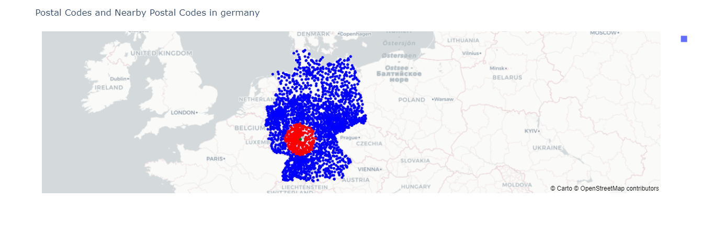

# Postal Code ETL and Rendering

The project consists of the development of a set of modules to extract the names of the cities of a country, the postal codes, obtain coordinates from postal codes, as well as the visualization on a map of the results obtained. The project focuses on the country of Germany, but it can be adapted for other countries as well.


# Challenge: 
Germany is divided in post-codes (documentation here: https://worldpostalcode.com/germany/  and here: https://en.wikipedia.org/wiki/Postal_codes_in_Germany.
Now I would like you to build a small scraper, that downloads a list of all German cities from wikipedia (https://de.wikipedia.org/wiki/Liste_der_St%C3%A4dte_in_Deutschland)
and gets the postcode(s) from each of this cities. 
After that, convert the postcode to longitude and latitude coordinates and return the results in a table or csv. 
Finally, I would like you to write a function, that takes a postcode or city name and radius (in km) as input and returns all postcodes within the radius. 

Please keep in mind, that this is not only about functionality but also about maintainability, readability and style.
Good luck and I am waiting to hear from you as soon as you feel confident with your results.


# Solution 

The solution is divided on 3 stages:

- Extraction: This stage is responsible for extracting the list of all the German cities and the postal codes of each one. For that was created the class `PostalCodeExtraction` from  the module `postalcode_extraction`
- Transform: In this stage, transformations are carried out such as cleaning and obtaining the coordinates from the extracted data. For that was created the class `PostalCodeTransform` from  the module `postalcode_transformation`
- Load: At this stage are the functionalities related to obtaining the postal codes close to a reference one, as well as the visualization of the results obtained. For that was created the classes `PostalCodeLoader` and `PostalCodeRenderer` of modules `postalcode_loader` and `postalcode_renderer` respectively.

## Installation

1. Clone the repository to your local machine:

   ```
   git clone git clone https://github.com/cgn00/Postal_Code_ETL.git


   ```

2. Navigate to the project directory:

   ```
   cd Postal_Code_ETL
   ```

3. Create a virtual environment (optional but recommended):

   ```
   python3 -m venv venv
   source venv/bin/activate
   ```

4. Install the required packages:

   ```
   pip install -r requirements.txt
   ```

## Usage

1. Open the main script `main.ipynb` or `main.py` on your text editor to analyze the code and run it.

2. Review the output and any generated files, such as CSV files containing postal codes and coordinates.

# Example

## Importing packages

```python
import pandas as pd
import time

from src.postalcode_extraction import PostalCodeExtraction
from src.postalcode_transformation import PostalCodeTransform
from src.postalcode_loader import PostalCodeLoader
from src.postalcode_renderer import PostalCodeRenderer


```

## Extraction

In this stage will be scraped the list of all German cities from wikipedia (https://de.wikipedia.org/wiki/Liste_der_St%C3%A4dte_in_Deutschland)
and the postcode(s) from each of this cities. The class `PostalCodeExtraction` defines methods for extracting the cities and postal codes data from web pages.

First, an instance of the PostalCodeExtraction class is created with Germany as the country. Next, the scrape_cities method of the `PostalCodeExtraction` class is used to scrape a list of cities in Germany from the Wikipedia page “Liste der Städte in Deutschland”. The resulting data is stored in a pandas DataFrame.

Finally, the scrape_postals_code method is used to scrape postal codes for the cities in the DataFrame.

When you run the first cell an "etl_postal_code.log" file is created, here you can track the process.


```python
country = 'germany'
extractor = PostalCodeExtraction(country)
extractor.scrape_cities()
extractor.scrape_postals_code()
```

## Transform  
In order to convert the postcode to longitude and latitude coordinates, the data scraped above most be transformed. The class `PostalCodeTransform` defines methods to transform the extracted data.

The first step of this stage is to clean the pandas series of postal codes and convert them to a standard format. The scraped postal codes of each citie is on `str` format that represents one or more postal codes, separated by commas or hyphens. For example, "12345, 67890" or "23456–23459". In order to convert the postcode to longitude and latitude coordinates, each string most be converted to a list of str.

Finally the postal codes are transformed into coordinates.

```python
transforms = PostalCodeTransform(country)
transforms.clean_postal_codes()
transforms.split_cities_postal_codes()
coordinates_df = transforms.get_coordinates(max_workers=8)
```

## Load 
The step of take a postcode or city name and a radius (in km) as input and returns all postcodes within the radius belong to a Load stage.


Show nearby postal codes by a reference postal code

```python
# Choose a reference postal code and a radius in kilometers
reference_postal_code = coordinates_df.loc[12, 'PostalCode']
radius_km = 100

# Find nearby postal codes within the specified radius
nearby_postal_codes = PostalCodeLoader(country).find_nearby_postal_codes_by_distance(reference_postal_code=reference_postal_code, radius_km=radius_km)
# Print the nearby postal codes and render an interactive map
if nearby_postal_codes.any():
    print(f"Nearby Postal Codes: {', '.join(nearby_postal_codes)}")
    PostalCodeRenderer(country).render_nearby_postalcodes_interactive(reference_postal_code, nearby_postal_codes)
else:
    print("No nearby postal codes found.")
```



Show nearby postal codes by a reference City

```python
# Choose a reference City and a radius in kilometers
reference_city = 'Berlin'
reference_postal_code = coordinates_df.loc[coordinates_df['City'] == reference_city, 'PostalCode'].values[0]
radius_km = 100

# Find nearby postal codes within the specified radius
nearby_postal_codes = PostalCodeLoader(country).find_nearby_postal_codes_by_distance(reference_city = reference_city, radius_km=radius_km)
# Print the nearby postal codes and render an interactive map
if nearby_postal_codes.any():
    print(f"Nearby Postal Codes: {', '.join(nearby_postal_codes)}")
    PostalCodeRenderer(country).render_nearby_postalcodes_interactive(reference_postal_code, nearby_postal_codes)
else:
    print("No nearby postal codes found.")
```


Show nearby postal codes in a bounding box by a reference postal code

```python
# Choose a reference postal code and a radius in kilometers
reference_postal_code = coordinates_df.loc[0, 'PostalCode']
radius_km = 100

# Find nearby postal codes within the specified radius
nearby_postal_codes = PostalCodeLoader(country).find_nearby_postal_codes_by_bounding(reference_postal_code, radius_km)
# Print the nearby postal codes and render an interactive map
if nearby_postal_codes.any():
    print(f"Nearby Postal Codes: {', '.join(nearby_postal_codes)}")
    PostalCodeRenderer(country).render_nearby_postalcodes_interactive(reference_postal_code, nearby_postal_codes)
else:
    print("No nearby postal codes found.")
```


